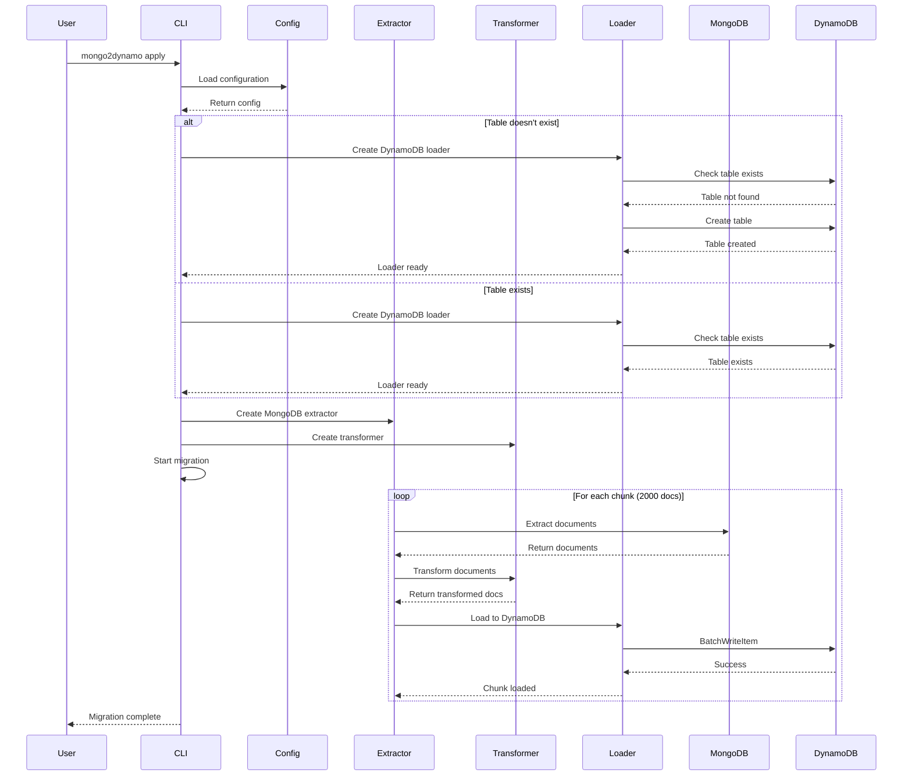

# mongo2dynamo

<p align="center">
  
</p>

**mongo2dynamo** is a command-line tool for migrating data from MongoDB to DynamoDB.

[](https://github.com/dutymate/mongo2dynamo/actions/workflows/build.yaml)
[](LICENSE)

- [Features](#features)
- [Installation](#installation)
- [Quick Start](#quick-start)
- [Configuration](#configuration)
- [Commands](#commands)
- [How It Works](#how-it-works)
- [License](#license)

## Features

- **ETL-based Migration**: Complete Extract, Transform, Load pipeline for MongoDB to DynamoDB migration
- **Batch Processing**: Memory-efficient processing with MongoDB batch size (1000) and chunk size (2000) for processing
- **MongoDB Filtering**: Selective data extraction using MongoDB query syntax via `--mongo-filter` flag
- **Automatic Table Creation**: Creates DynamoDB tables automatically with configurable confirmation prompts
- **Retry Logic**: Robust error handling with exponential backoff and jitter (configurable via `--max-retries`, default: 5)
- **Dry-run Support**: Preview migration plans by executing full ETL pipeline without loading to DynamoDB
- **Flexible Configuration**: Support for command-line flags, environment variables, and YAML config files
- **Interactive Confirmation**: User-friendly prompts for critical operations (can be bypassed with `--auto-approve`)

## Installation

### Homebrew

```bash
brew tap dutymate/tap
brew install mongo2dynamo
```

### Download Binary

Download the latest release from the [releases page](https://github.com/dutymate/mongo2dynamo/releases).

### Build from Source

```bash
git clone https://github.com/dutymate/mongo2dynamo.git
cd mongo2dynamo
make build
```

## Quick Start

```bash
# Preview migration
mongo2dynamo plan --mongo-db mydb --mongo-collection users

# Execute migration
mongo2dynamo apply --mongo-db mydb --mongo-collection users --dynamo-endpoint http://localhost:8000

# With filter and auto-approve
mongo2dynamo apply --mongo-db mydb --mongo-collection users \
  --dynamo-endpoint http://localhost:8000 \
  --mongo-filter '{"status": "active"}' \
  --auto-approve
```

## Configuration

### Environment Variables

```bash
export MONGO2DYNAMO_MONGO_HOST=localhost
export MONGO2DYNAMO_MONGO_PORT=27017
export MONGO2DYNAMO_MONGO_USER=your_username
export MONGO2DYNAMO_MONGO_PASSWORD=your_password
export MONGO2DYNAMO_MONGO_DB=your_database
export MONGO2DYNAMO_MONGO_COLLECTION=your_collection
export MONGO2DYNAMO_MONGO_FILTER='{"status": "active"}'
export MONGO2DYNAMO_DYNAMO_TABLE=your_table
export MONGO2DYNAMO_DYNAMO_ENDPOINT=http://localhost:8000
export MONGO2DYNAMO_AWS_REGION=us-east-1
export MONGO2DYNAMO_MAX_RETRIES=5
export MONGO2DYNAMO_AUTO_APPROVE=false
```

### Config File

Create `~/.mongo2dynamo/config.yaml`:

```yaml
mongo_host: localhost
mongo_port: 27017
mongo_user: your_username
mongo_password: your_password
mongo_db: your_database
mongo_collection: your_collection
mongo_filter: '{"status": "active"}'
dynamo_table: your_table
dynamo_endpoint: http://localhost:8000
aws_region: us-east-1
max_retries: 5
auto_approve: false
```

## Commands

### `plan` - Preview Migration

Performs a dry-run to preview the migration by executing the full ETL pipeline without loading to DynamoDB.

**Features:**
- Connects to MongoDB and validates configuration
- Extracts documents from MongoDB (with filters if specified)
- Transforms documents to DynamoDB format
- Counts the total number of documents that would be migrated
- No data is loaded to DynamoDB (dry-run mode)

**Example Output:**
```text
Starting migration plan analysis...
Found 1,234 documents to migrate.
```

### `apply` - Execute Migration

Executes the complete ETL pipeline to migrate data from MongoDB to DynamoDB.

**Features:**
- Full ETL pipeline execution (Extract → Transform → Load)
- Configuration validation and user confirmation prompts
- Automatic DynamoDB table creation (with confirmation)
- Batch processing with fixed chunk sizes (2000 documents per chunk)
- Retry logic for failed operations (configurable via `--max-retries`)

**Example Output:**
```text
Creating DynamoDB table 'users'...
Waiting for table 'users' to become active...
Table 'users' is now active and ready for use.
Starting data migration from MongoDB to DynamoDB...
Successfully migrated 1,234 documents.
```

### `version` - Show Version

Displays version information including Git commit and build date.

## How It Works

mongo2dynamo implements a robust ETL pipeline with the following components:



### 1. Extraction (MongoDB)

- **Connection**: Establishes connection to MongoDB using provided credentials
- **Filtering**: Applies MongoDB query filters (JSON to BSON conversion)
- **Batch Processing**: Extracts documents in configurable batches (1000 documents per batch)
- **Chunking**: Groups documents into chunks (2000 documents per chunk) for processing

### 2. Transformation

- **ID Conversion**: Converts MongoDB `_id` field to DynamoDB `id` field
- **Field Cleanup**: Removes MongoDB-specific fields (`__v`, `_class`)
- **Type Handling**: Converts ObjectID to string format for DynamoDB compatibility
- **Parallel Processing**: Uses worker pools for efficient transformation

### 3. Loading (DynamoDB)

- **Table Management**: Checks table existence and creates if needed
- **Batch Writing**: Uses DynamoDB BatchWriteItem API (25 items per batch)
- **Retry Logic**: Implements exponential backoff with jitter for failed operations
- **Error Handling**: Provides detailed error messages and recovery options

### Table Creation

- **Auto-creation**: DynamoDB tables are created automatically if they don't exist
- **Table naming**: Uses collection name as table name (with confirmation if not specified)
- **Schema**: Simple table with `id` as primary key
- **Confirmation**: Prompts for user confirmation unless `--auto-approve` is used

## License

Licensed under the [MIT License](LICENSE).
