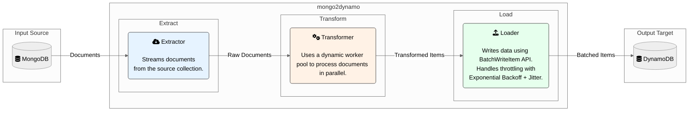

# mongo2dynamo

<p align="center">
  
</p>

**mongo2dynamo** is a high-performance, command-line tool for migrating data from MongoDB to DynamoDB, built with Go.

[](https://github.com/dutymate/mongo2dynamo/actions/workflows/build.yaml)
[](LICENSE)

- [Features](#features)
- [Installation](#installation)
- [Quick Start](#quick-start)
- [Configuration](#configuration)
- [Commands](#commands)
- [How It Works](#how-it-works)
- [License](#license)

## Features

mongo2dynamo is designed for efficient and reliable data migration, incorporating several key features for performance and stability.

-   **High-Performance Transformation**: Utilizes a **dynamic worker pool** that dynamically scales based on CPU cores (from 2 to 2x `runtime.NumCPU()`). This allows for parallel processing of data transformation, maximizing throughput.
-   **Robust Loading Mechanism**: Implements a reliable data loading strategy for DynamoDB using the `BatchWriteItem` API. It incorporates an **Exponential Backoff with Jitter** algorithm to automatically handle and recover from DynamoDB's throttling exceptions, ensuring a smooth migration process.
-   **Memory-Efficient Extraction**: Employs a streaming approach to extract data from MongoDB in manageable chunks, minimizing the application's memory footprint, even with large datasets.
-   **Memory Pool Optimization**: Implements shared memory pools (`DocumentPool` and `ChunkPool`) across the entire ETL pipeline to reduce garbage collection overhead and improve memory efficiency during large-scale migrations.
-   **Fine-Grained Error Handling**: Defines domain-specific custom error types for each stage of the ETL process (Extract, Transform, Load). This enables precise error identification and facilitates targeted recovery logic.
-   **Comprehensive CLI**: Built with `Cobra`, it provides a user-friendly command-line interface with `plan` (dry-run) and `apply` commands, flexible configuration options (flags, env vars, config file), and an `--auto-approve` flag for non-interactive execution.

## Installation

### Homebrew

```bash
brew tap dutymate/tap
brew install mongo2dynamo
```

### Download Binary

Download the latest release from the [releases page](https://github.com/dutymate/mongo2dynamo/releases).

### Build from Source

```bash
git clone https://github.com/dutymate/mongo2dynamo.git
cd mongo2dynamo
make build
```

## Quick Start

```bash
# Preview migration
mongo2dynamo plan --mongo-db mydb --mongo-collection users

# Execute migration
mongo2dynamo apply --mongo-db mydb --mongo-collection users --dynamo-endpoint http://localhost:8000

# With filter and auto-approve
mongo2dynamo apply --mongo-db mydb --mongo-collection users \
  --dynamo-endpoint http://localhost:8000 \
  --mongo-filter '{"status": "active"}' \
  --auto-approve
```

## Configuration

### Environment Variables

```bash
export MONGO2DYNAMO_MONGO_HOST=localhost
export MONGO2DYNAMO_MONGO_PORT=27017
export MONGO2DYNAMO_MONGO_USER=your_username
export MONGO2DYNAMO_MONGO_PASSWORD=your_password
export MONGO2DYNAMO_MONGO_DB=your_database
export MONGO2DYNAMO_MONGO_COLLECTION=your_collection
export MONGO2DYNAMO_MONGO_FILTER='{"status": "active"}'
export MONGO2DYNAMO_DYNAMO_TABLE=your_table
export MONGO2DYNAMO_DYNAMO_ENDPOINT=http://localhost:8000
export MONGO2DYNAMO_AWS_REGION=us-east-1
export MONGO2DYNAMO_MAX_RETRIES=5
export MONGO2DYNAMO_AUTO_APPROVE=false
```

### Config File

Create `~/.mongo2dynamo/config.yaml`:

```yaml
mongo_host: localhost
mongo_port: 27017
mongo_user: your_username
mongo_password: your_password
mongo_db: your_database
mongo_collection: your_collection
mongo_filter: '{"status": "active"}'
dynamo_table: your_table
dynamo_endpoint: http://localhost:8000
aws_region: us-east-1
max_retries: 5
auto_approve: false
```

## Commands

### `plan` - Preview Migration

Performs a dry-run to preview the migration by executing the full ETL pipeline without loading to DynamoDB.

**Features:**
- Connects to MongoDB and validates configuration.
- Extracts documents from MongoDB (with filters if specified).
- Transforms documents to DynamoDB format using dynamic worker pools.
- Counts the total number of documents that would be migrated.
- No data is loaded to DynamoDB (dry-run mode).

**Example Output:**
```text
Starting migration plan analysis...
Found 1,234 documents to migrate.
```

### `apply` - Execute Migration

Executes the complete ETL pipeline to migrate data from MongoDB to DynamoDB.

**Features:**
- Full ETL pipeline execution (Extract → Transform → Load).
- Configuration validation and user confirmation prompts.
- Automatic DynamoDB table creation (with confirmation).
- Batch processing with configurable chunk sizes (2000 documents per extraction chunk, 1000 documents per pipeline chunk, 25 documents per DynamoDB batch).
- Dynamic worker pool scaling for optimal performance.
- Retry logic for failed operations (configurable via `--max-retries`).

**Example Output:**
```text
Creating DynamoDB table 'users'...
Waiting for table 'users' to become active...
Table 'users' is now active and ready for use.
Starting data migration from MongoDB to DynamoDB...
Successfully migrated 1,234 documents.
```

### `version` - Show Version

Displays version information including Git commit and build date.

## How It Works

mongo2dynamo follows a standard Extract, Transform, Load (ETL) architecture with parallel processing capabilities. Each stage is designed to perform its task efficiently and reliably.

### Pipeline Architecture
- **Parallel Processing**: The ETL stages run concurrently using Go channels, allowing extraction, transformation, and loading to happen simultaneously for maximum throughput.
- **Shared Memory Pools**: All pipeline components share `DocumentPool` and `ChunkPool` instances to minimize memory allocations and improve performance.



### 1. Extraction
- Connects to MongoDB and fetches documents from the specified collection.
- Uses a streaming approach to handle large datasets with low memory usage.
- Applies user-defined filters (`--mongo-filter`) to select specific data for migration.

### 2. Transformation
- Receives raw documents from the Extractor.
- **Converts MongoDB-specific fields** (e.g., `_id` -> `id`) and cleans up unnecessary data (e.g., `__v`, `_class`).
- Distributes the transformation tasks to a **dynamic pool of worker goroutines**. The pool size adjusts dynamically based on the workload and available CPU cores to maximize parallel processing efficiency.

### 3. Loading
- Receives transformed items and groups them into batches suitable for DynamoDB's `BatchWriteItem` API (max 25 items per request).
- If DynamoDB throttles the requests (returns a `ProvisionedThroughputExceededException`), the Loader automatically retries the batch using an **exponential backoff with jitter** strategy. This prevents overwhelming the table and ensures all data is eventually written.
- Manages automatic creation of the destination DynamoDB table if it doesn't exist.

## License

Licensed under the [MIT License](LICENSE).
