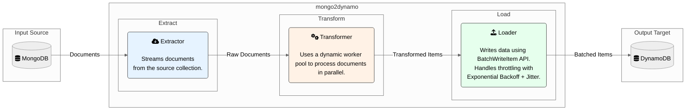

# mongo2dynamo

<p align="center">
  
</p>

**mongo2dynamo** is a high-performance, command-line tool for migrating data from MongoDB to DynamoDB.

[](https://github.com/dutymate/mongo2dynamo/actions/workflows/build.yaml)
[](LICENSE)

- [Features](#features)
- [Installation](#installation)
- [Quick Start](#quick-start)
- [Configuration](#configuration)
- [Commands](#commands)
- [How It Works](#how-it-works)
- [License](#license)

## Features

mongo2dynamo is designed for efficient and reliable data migration, incorporating several key features for performance and stability.

-   **High-Performance Transformation**: Utilizes a **dynamic worker pool** that scales based on CPU cores (from 2 to 2x `runtime.NumCPU()`) with real-time workload monitoring. Workers auto-scale every 500ms based on pending jobs, maximizing parallel processing efficiency.
-   **Optimized Memory Management**: Implements strategic memory allocation - extractor uses `ChunkPool` for efficient slice reuse during document streaming, while transformer uses direct allocation with pre-calculated capacity for optimal performance based on benchmarking.
-   **Advanced Backpressure Control**: Features an **optimized backpressure mechanism** that automatically manages data flow between pipeline stages, preventing memory overflow and ensuring stable performance under high load conditions.
-   **Robust Loading Mechanism**: Implements a reliable data loading strategy for DynamoDB using the `BatchWriteItem` API with a **concurrent worker pool**. Features **Exponential Backoff with Jitter** algorithm to automatically handle DynamoDB throttling exceptions, ensuring smooth migration process.
-   **Memory-Efficient Extraction**: Employs a streaming approach to extract data from MongoDB in configurable chunks (default: 2000 documents), minimizing memory footprint even with large datasets. Supports MongoDB query filters and projections for selective migration.
-   **Intelligent Field Processing**: Removes framework metadata (`__v`, `_class`) while preserving all other fields including `_id`. Pre-calculates output document capacity to minimize memory allocations during transformation.
-   **Fine-Grained Error Handling**: Defines domain-specific custom error types for each stage of the ETL process (Extract, Transform, Load). This enables precise error identification and facilitates targeted recovery logic.
-   **Comprehensive CLI**: Built with `Cobra`, providing a user-friendly command-line interface with `plan` (dry-run) and `apply` commands, flexible configuration options (flags, env vars, config file), and an `--auto-approve` flag for non-interactive execution.
-   **Automatic Table Management**: Automatically creates DynamoDB tables if they don't exist, with user confirmation prompts (unless auto-approved). **Supports custom primary keys (Partition and Sort Keys).** Waits for table activation before proceeding with migration.
-   **Real-Time Progress Tracking**: Provides visual progress indicators with real-time status updates, processing rate, and estimated completion time. Progress display can be disabled with `--no-progress` flag for non-interactive environments.
-   **Prometheus Metrics**: Built-in monitoring with Prometheus-compatible metrics for real-time performance tracking, including document processing rates, error counts, migration duration, and worker pool utilization. Metrics server can be enabled with `--metrics-enabled` flag.

## Installation

### Homebrew

```bash
brew tap dutymate/tap
brew install mongo2dynamo
```

### Download Binary

Download the latest release from the [releases page](https://github.com/dutymate/mongo2dynamo/releases).

### Build from Source

```bash
git clone https://github.com/dutymate/mongo2dynamo.git
cd mongo2dynamo
make build
```

## Quick Start

```bash
# Preview migration
mongo2dynamo plan --mongo-db mydb --mongo-collection users

# Execute migration with a custom primary key (Partition + Sort Key)
mongo2dynamo apply --mongo-db mydb --mongo-collection events \
  --dynamo-table user-events \
  --dynamo-partition-key event_id \
  --dynamo-partition-key-type S \
  --dynamo-sort-key timestamp \
  --dynamo-sort-key-type N

# With filter and auto-approve
mongo2dynamo apply --mongo-db mydb --mongo-collection users \
  --mongo-filter '{"status": "active"}' \
  --auto-approve

# With projection to select specific fields (default excludes __v and _class)
mongo2dynamo apply --mongo-db mydb --mongo-collection users \
  --mongo-projection '{"name": 1, "email": 1}' \
  --auto-approve

# Disable progress display for non-interactive environments
mongo2dynamo apply --mongo-db mydb --mongo-collection users \
  --no-progress

# Enable Prometheus metrics for monitoring
mongo2dynamo apply --mongo-db mydb --mongo-collection users \
  --metrics-enabled \
  --metrics-addr :2112
```

## Configuration

Configuration can be provided via command-line flags, environment variables, or a YAML configuration file. The order of precedence is:
1. Command-Line Flags
2. Environment Variables
3. Configuration File
4. Default Values

### Command-Line Flags

**MongoDB Flags**

| Flag | Description | Default |
| --- | --- | --- |
| `--mongo-host` | MongoDB host. | `localhost` |
| `--mongo-port` | MongoDB port. | `27017` |
| `--mongo-user` | MongoDB username. | ` ` |
| `--mongo-password` | MongoDB password. | ` ` |
| `--mongo-db` | **(Required)** MongoDB database name. | ` ` |
| `--mongo-collection` | **(Required)** MongoDB collection name. | ` ` |
| `--mongo-filter` | MongoDB query filter as a JSON string. | ` ` |
| `--mongo-projection` | MongoDB projection as a JSON string to select specific fields. | `{"__v":0,"_class":0}` |

**DynamoDB Flags**

| Flag | Description | Default |
| --- | --- | --- |
| `--dynamo-endpoint` | DynamoDB endpoint. | `http://localhost:8000` |
| `--dynamo-table` | DynamoDB table name. | MongoDB collection name |
| `--dynamo-partition-key` | The attribute name for the partition key. | `_id` |
| `--dynamo-partition-key-type` | The attribute type for the partition key (S, N, B). | `S` |
| `--dynamo-sort-key` | The attribute name for the sort key. (Optional) | ` ` |
| `--dynamo-sort-key-type` | The attribute type for the sort key (S, N, B). | `S` |
| `--aws-region` | AWS region. | `us-east-1` |
| `--max-retries` | Maximum retries for failed DynamoDB batch writes. | `5` |

**Control Flags**

| Flag | Description | Default |
| --- | --- | --- |
| `--auto-approve` | Skip all confirmation prompts (applies only to the apply command). | `false` |
| `--no-progress` | Disable progress display during migration. | `false` |

**Monitoring Flags**

| Flag | Description | Default |
| --- | --- | --- |
| `--metrics-enabled` | Enable Prometheus metrics server for monitoring. | `false` |
| `--metrics-addr` | Address for the metrics server to listen on. | `:2112` |

### Environment Variables

```bash
export MONGO2DYNAMO_MONGO_HOST=localhost
export MONGO2DYNAMO_MONGO_PORT=27017
export MONGO2DYNAMO_MONGO_USER=your_username
export MONGO2DYNAMO_MONGO_PASSWORD=your_password
export MONGO2DYNAMO_MONGO_DB=your_database
export MONGO2DYNAMO_MONGO_COLLECTION=your_collection
export MONGO2DYNAMO_MONGO_FILTER='{"status": "active"}'
export MONGO2DYNAMO_MONGO_PROJECTION='{"__v":0,"_class":0}'
export MONGO2DYNAMO_DYNAMO_ENDPOINT=http://localhost:8000
export MONGO2DYNAMO_DYNAMO_TABLE=your_table
export MONGO2DYNAMO_DYNAMO_PARTITION_KEY=_id
export MONGO2DYNAMO_DYNAMO_PARTITION_KEY_TYPE=S
export MONGO2DYNAMO_DYNAMO_SORT_KEY=timestamp
export MONGO2DYNAMO_DYNAMO_SORT_KEY_TYPE=N
export MONGO2DYNAMO_AWS_REGION=us-east-1
export MONGO2DYNAMO_MAX_RETRIES=5
export MONGO2DYNAMO_AUTO_APPROVE=false
export MONGO2DYNAMO_NO_PROGRESS=false
export MONGO2DYNAMO_METRICS_ENABLED=false
export MONGO2DYNAMO_METRICS_ADDR=:2112
```

### Config File

Create `~/.mongo2dynamo/config.yaml`:

```yaml
mongo_host: localhost
mongo_port: 27017
mongo_user: your_username
mongo_password: your_password
mongo_db: your_database
mongo_collection: your_collection
mongo_filter: '{"status": "active"}'
mongo_projection: '{"__v":0,"_class":0}'
dynamo_endpoint: http://localhost:8000
dynamo_table: your_table
dynamo_partition_key: _id
dynamo_partition_key_type: S
dynamo_sort_key: timestamp
dynamo_sort_key_type: N
aws_region: us-east-1
max_retries: 5
auto_approve: false
no_progress: false
metrics_enabled: false
metrics_addr: ":2112"
```

## Commands

### `plan` - Preview Migration

Performs a dry-run to preview the migration by executing the full ETL pipeline without loading to DynamoDB.

**Features:**
- Connects to MongoDB and validates configuration.
- Extracts documents from MongoDB (with filters and projections if specified).
- Transforms documents to DynamoDB format using dynamic worker pools with backpressure control.
- Counts the total number of documents that would be migrated.
- No data is loaded to DynamoDB (dry-run mode).
- Provides Prometheus metrics when enabled (document counts, processing rates, error tracking, worker pool utilization).

**Example Output:**
```text
Starting migration plan analysis...
▶ 904,000/2,000,000 items (45.2%) | 120,000 items/sec | 9s left
Found 2,000,000 documents to migrate.
```

### `apply` - Execute Migration

Executes the complete ETL pipeline to migrate data from MongoDB to DynamoDB.

**Features:**
- Full ETL pipeline execution (Extract → Transform → Load).
- Configuration validation and user confirmation prompts.
- Automatic DynamoDB table creation (with confirmation).
- Batch processing with optimized chunk sizes (1000 documents per MongoDB batch, 2000 documents per extraction chunk, 25 documents per DynamoDB batch, concurrent loader workers).
- Dynamic worker pool scaling with intelligent backpressure control for optimal performance.
- Retry logic for failed operations (configurable via `--max-retries`).
- Real-time Prometheus metrics for monitoring migration progress, performance, error rates, and worker pool efficiency.

**Example Output:**
```text
Creating DynamoDB table 'users'...
Waiting for table 'users' to become active...
Table 'users' is now active and ready for use.
Starting data migration from MongoDB to DynamoDB...
▶ 904,000/2,000,000 items (45.2%) | 20,000 items/sec | 54s left
Successfully migrated 2,000,000 documents.
```

### `version` - Show Version

Displays version information including Git commit and build date.

## How It Works

mongo2dynamo follows a standard Extract, Transform, Load (ETL) architecture with parallel processing capabilities. Each stage is designed to perform its task efficiently and reliably.

### Monitoring and Metrics

When metrics are enabled (`--metrics-enabled`), mongo2dynamo provides comprehensive Prometheus-compatible metrics for real-time monitoring:

- **Document Processing Metrics**: Total documents, processed documents, and processing rates
- **Error Tracking**: Transformation errors, loading errors, and error rates by type
- **Performance Metrics**: Migration duration, throughput, and worker pool utilization
- **Migration Status**: Success/failure status and completion tracking
- **Worker Pool Metrics**: Active workers, queue depth, and backpressure status
- **Pipeline Health**: Channel buffer usage and data flow monitoring

The metrics server runs on the specified address (default: `:2112`) and can be scraped by Prometheus or other monitoring systems for comprehensive observability during migration operations.

### Pipeline Architecture
- **Parallel Processing**: The ETL stages run concurrently using Go channels with a buffer size of 10, allowing extraction, transformation, and loading to happen simultaneously for maximum throughput.
- **Strategic Memory Optimization**: Components use independent memory strategies optimized for their specific workloads - extractor leverages `ChunkPool` for slice reuse, while transformer uses direct allocation for maximum speed.
- **Advanced Backpressure Control**: Implements intelligent backpressure mechanisms that automatically manage data flow between pipeline stages, preventing memory overflow and ensuring stable performance under high load conditions.



### 1. Extraction
- Connects to MongoDB using optimized connection settings with configurable batch sizes (default: 1000 documents per batch).
- Uses a streaming approach with `ChunkPool` memory reuse to handle large datasets efficiently.
- Processes documents in configurable chunks (default: 2000 documents) to maintain low memory footprint.
- Applies user-defined filters (`--mongo-filter`) with JSON-to-BSON conversion for selective data migration.
- Applies default projection to exclude framework metadata (`__v`, `_class`) unless overridden by `--mongo-projection`.
- Implements robust error handling for connection, decode, and cursor operations.

### 2. Transformation
- Utilizes a **dynamic worker pool** starting with CPU core count, scaling up to 2x CPU cores based on workload.
- **Intelligent scaling**: Workers auto-adjust every 500ms with optimized thresholds (scale up at 80% load, scale down at 30% load).
- **Bidirectional scaling**: Automatically scales down when workload decreases to optimize resource usage.
- **Advanced backpressure control**: Implements optimized backpressure mechanisms that automatically manage data flow, preventing memory overflow and ensuring stable performance.
- **Memory optimization**: Pre-calculates field counts to allocate maps with optimal capacity, reducing garbage collection overhead.
- **Field processing**: Preserves all fields including `_id` with intelligent type handling (ObjectID → hex, bson.M → JSON). Framework metadata (`__v`, `_class`) is excluded by default via MongoDB projection.
- Implements panic recovery and comprehensive error reporting for worker failures.

### 3. Loading
- Uses a **concurrent worker pool** to maximize DynamoDB throughput with parallel batch processing.
- Groups documents into optimal batches of 25 items per `BatchWriteItem` request (DynamoDB limit).
- **Advanced retry logic**: Implements exponential backoff with jitter (100ms to 30s) for unprocessed items, with configurable max retries (default: 5).
- **Automatic table management**: Creates tables with hash key schema if they don't exist, waits for table activation.
- Handles context cancellation gracefully across all worker goroutines.

## License

Licensed under the [MIT License](LICENSE).
